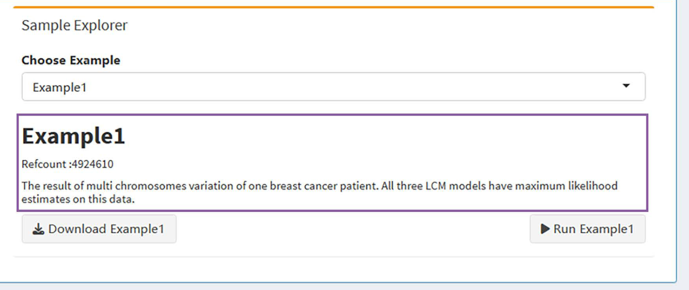
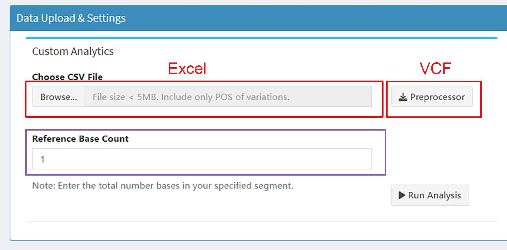

### Description
cascAGS is a program that estimates the sensitivity and specificity of variant calling methods based on latent class models (LCMs) to evaluate their accuracy in the absence of SNP gold standards. It can be used to process input files in Excel or VCF format, generating sensitivity and false positive rate (Specificity=1–false positive rate) estimates under assumptions of conditional independence and conditional dependence (including constant random effects and variable random effects).

cascAGS is suitable for the accuracy evaluation of three calling methods under conditional independence assumption, and accuracy evaluation under any assumption of more than four calling 
methods, where LCM estimates each parameter using the maximum likelihood method.

### How to run cascAGS
We recommend using R. You can download the complete repository and unzip it. Functions for the interactive page are defined in the files within the  R folder. To compare calling methods, 
the readers can do the following:

1. Click the Run App on the APP.R to obtain the webpage;

2. Upload your Excel file through Browse, or click Preprocessor to download Preprocessor.R to convert your VCF, then upload the output CSV file through Browse. In Preprocessor.R, you only need to change the VCF file path on line 32 to your local save path and run the entire R file to obtain the processed CSV output.

3. Input the total number of bases or individuals on Reference Base Count;

4. Click Run Analysis to start the analysis.

You should now see output similar to the example results by clicking the Run Example at https://lish-bioinfo.shinyapps.io/cascAGS/. Being able to produce the above output shows that your system is up and running.

### Example data

To illustrate its practical application, we provide three example data, namely, the third-generation sequencing data of a breast cancer patient used in this paper, the sequencing data of chromosome 22 from PrecisionFDA, and the Uterine cardiovascular data, from seven pathologists. The total number of bases or patients (namely, Refcount) involved is provided under each example. Readers can click Download Example to download example data and view the data format. Or click Run Example to run the data and obtain the corresponding analysis results. When calculating the confidence interval of the parameters as in the main text, due to the introduction of the bootstrap method, the estimated value is slightly smaller than the directly calculated value here, but it does not affect the final accuracy ranking.

### Analysis Results & Visualization
#### Data Upload & Settings
In this section, you can upload your file and set the total number of base counts or individuals involved in your trial.

#### Venn Diagram
In this section, we present the number of SNPs detected by all calling methods, and the consistency between different methods can be seen from the diagram. The SNPs corresponding to each number in the Venn plot are summarized in a table. Readers can click Download CSV to view the chromosomes and coordinates of all corresponding SNPs and click Download PDF to obtain the diagram.

#### Sensitivity & False Positive Rate
In this section, we present the sensitivity and false positive rate of all calling methods estimated using the latent class model under the assumptions of conditional independence and conditional dependence (including constant random effects and variable random effects) without gold standards and specificity=1-false positive rate. The LCMs corresponding to the three assumptions are named LCMC, LCR, and LCMR, respectively. Readers can click Download CSV to obtain all estimated values, and select the optimal estimated value based on the results of the Residual Analysis section as the sensitivity and false positive rate estimate for calling the method.

#### Residual Analysis
In this section, we present the residuals corresponding to the three assumptions mentioned earlier. For any two calling methods, we calculate the Pearson correlation coefficients of the observed frequency and the expected frequency, respectively. The expected frequency is obtained through LCM, and the difference between the two is called the residual. The closer the residual is to zero, the more accurate the estimate obtained based on this assumption. Readers can also obtain this graphic by clicking Download PNG or Download PDF.

#### SNP Count Estimation
In this section, we present the observed SNP frequency and the expected frequency estimated by LCM under three assumptions to illustrate the impact of dependency assumptions on the performance of LCM estimation. In addition, readers can check the original function themselves to obtain the class probability estimated by LCM to judge the accuracy of single or two calling methods. The final results can be obtained by clicking Download CSV.

